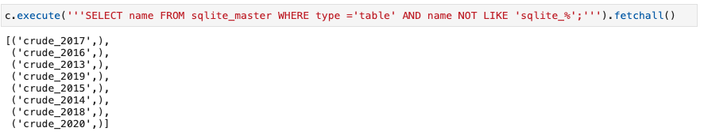
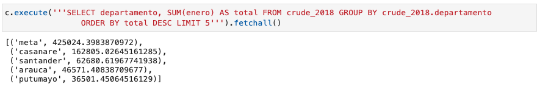
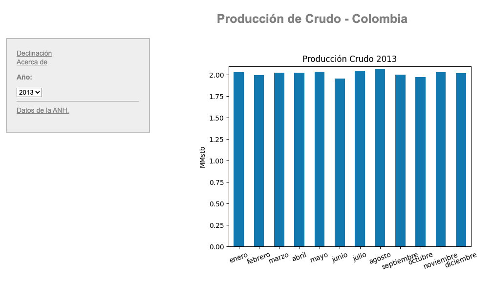
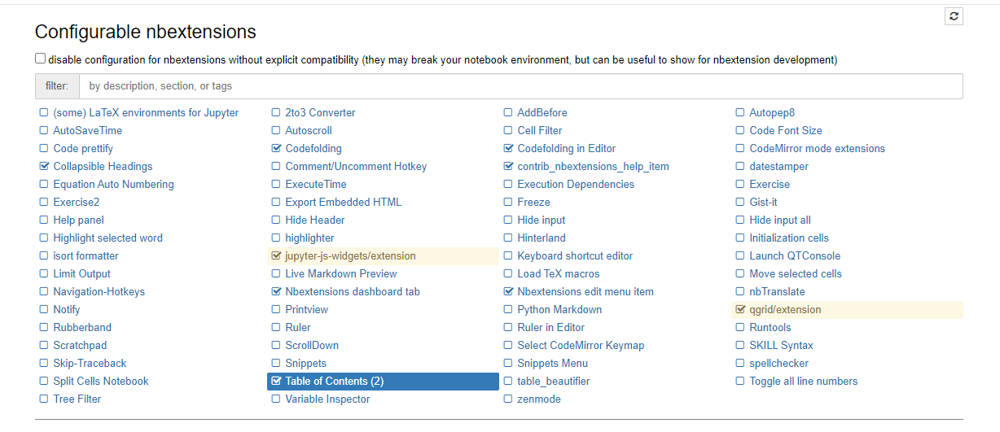
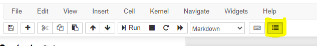

# Hackaton Oil & Gas 2020

## Getting Started

To download this repository use the following command in your terminal:
```bash
git clone https://github.com/Hackaton-O-G-CAN/Hackaton_2020.git
```
```bash
git clone git@github.com:Hackaton-O-G-CAN/Hackaton_2020.git
```
Or simply click on `Code` _>_ `Download ZIP`.

### Prerequisites

What things you need to install?

```
Python 3.8 or later
Javascript
CSS
Web Browser
Activate Jupyter extensions
Qgrid in python terminal 
Check requirements.txt file to check more required Python libraries and modules.
```
### How to run the code?

Open a terminal in the same directory where the `main.py` file is located and run the following command in your terminal,
```bash
python3 main.py
```
Or,
```bash
python main.py
```
It the commands above do not work check your Python installation.

Run the tasks and answers from the Jupyter Notebook answers


Once the `main.py` file starts runnings, the start and completion of the stages will show up in the console as follows,
```bash
Loading data
Loading data finished
Cleanning data
Cleaning data finsihed
Initializing database
Creating tables
Dumped tables into database finished
Generating web interface
Rendering images
Images rendered
Web interface generated
```
Once the `main.py` file finished running you will have the following new folders in the directory,
```bash
.
├── _data
├── _web
│   ├── assets
│
├── _database
├
```

### Code

The current code is composed of multiple modules which can be found in `utils/` folder, that are listed below:

```Python
downloadData.py
```
This module scrappes the [ANH](http://www.anh.gov.co/estadisticas-del-sector/sistemas-integrados-operaciones/estad%C3%ADsticas-producci%C3%B3n) webpage. It gets the hyperlinks to each of the spreadsheets. Finally, the files are downloaded to `data/` directory.

```Python
dataProc.py
```
This module process the dowloaded data and clean the dataframes according to their individual concerns.

```Python
generateDB.py
```
This module dumps dowloaded data to a database using SQLite. The `anh_database.db` can be found inside `database/` folder. The data can be accessed as shown below:

Another example is shown below:


```Python
generateWeb.py
```
This module generates a web interface where the data can be interactively accesssed. An example is shown below:


````
All the directories in the modules above have been optimized to avoid the differences between Unix/Posix/Windows.
````
### Notebook

In order to properly run this Notebook properly, please install the notebook extensions and the qgrid package.

Remember: 

<b> Qgrid </b> 

Installing with conda:

only required if you have not added conda-forge to your channels yet
```Python
conda config --add channels conda-forge

conda install qgrid
```

pip install qgrid:

```Python
jupyter nbextension enable --py --sys-prefix qgrid
```
only required if you have not enabled the ipywidgets nbextension yet

```Python
jupyter nbextension enable --py --sys-prefix widgetsnbextension
```
<b> Jupyter extensions: </b> 

Installation with conda:

conda install -c conda-forge jupyter_nbextensions_configurator
<br>
conda install -c conda-forge jupyter_contrib_nbextensions

Or with pip:

```Python
pip install jupyter_contrib_nbextensions && jupyter contrib nbextension install
```
in case you get permission errors on MacOS,

```Python
pip install jupyter_contrib_nbextensions && jupyter contrib nbextension install --user
```

Then in your localhost go to: http://localhost:8888/nbextensions?nbextension=codefolding/main and activate the folling extensions: codefolding, codefolding in editor, collapsible headings, table of contents, qgrid/extention



Once the installation is done, please activate the table of content for a better user experience



extensions reference: https://github.com/ipython-contrib/jupyter_contrib_nbextensions

## Web Interface

In the same directory where `main.py` file is located you will find `index.html`. Run it with a Live Server or with the browser of your preference.

## Authors

- Cindy Ortega - _cindy.or03@gmail.com_
- Nicolás Bueno - _nbuenoz@unal.edu.co_
- Alejandro Uribe - _jauriberamirez@gmail.com_

## License

This project is licensed under the MIT License - see the [LICENSE.md](LICENSE.md) file for details.